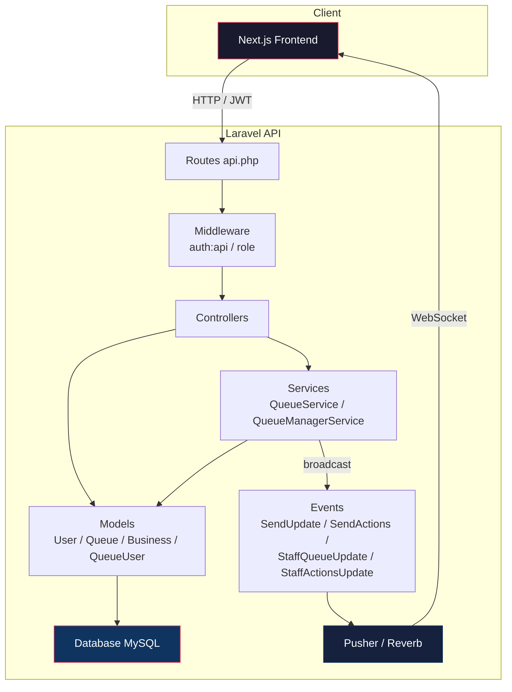

# Waitless — Backend API

A queue management system API built with Laravel 12. Handles business/queue CRUD, customer flow, real-time broadcasting, and role-based access.

## Tech Stack

| Layer | Technology |
|-------|-----------|
| **Framework** | Laravel 12.x |
| **Language** | PHP ^8.2 |
| **Database** | MySQL |
| **Auth** | JWT (`tymon/jwt-auth`) |
| **Real-time** | Laravel Reverb + Pusher |
| **Queue Driver** | Database |
| **Testing** | PHPUnit 11.x |

## Architecture



### Directory Layout

```
app/
├── Events/           — Real-time broadcasting events (Pusher)
├── Http/
│   ├── Controllers/
│   │   ├── Auth/              — Login, register, password reset, email verification
│   │   ├── BusinessManagement/ — Business & staff CRUD
│   │   └── QueueManagement/    — Queue CRUD, customer operations
│   └── Middleware/             — CheckUserRole, EnsureEmailIsVerified
├── Models/           — User, Business, Queue, QueueUser (pivot), ServedCustomer
├── Notifications/    — NewMessageNotification
├── Services/         — QueueService, QueueManagerService (business logic layer)
```

## Role System

| Role | Permissions |
|------|-------------|
| `business_owner` | Full access — manage queues, staff, business settings |
| `staff` | Manage queues, serve customers, no business/staff admin |
| `customer` | View own queues, join/leave queues, self-cancel |

## Setup

### Prerequisites

- PHP ^8.2
- Composer
- MySQL
- Pusher account (free tier works)

### Installation

```bash
# 1. Install dependencies
composer install

# 2. Environment
cp .env.example .env
# Edit .env — set DB_DATABASE, DB_USERNAME, DB_PASSWORD, PUSHER_* credentials

# 3. Generate keys
php artisan key:generate
php artisan jwt:secret

# 4. Database
php artisan migrate

# 5. (Optional) Seed demo data
php artisan db:seed

# 6. Start development servers
composer dev
# Starts: php artisan serve (port 8000) + queue worker + Vite
```

### Environment Variables

| Key | Description |
|-----|-------------|
| `DB_CONNECTION` | `mysql` |
| `DB_DATABASE` | Database name |
| `JWT_SECRET` | Token signing secret (`php artisan jwt:secret`) |
| `BROADCAST_DRIVER` | `pusher` |
| `PUSHER_APP_ID` | Pusher app ID |
| `PUSHER_APP_KEY` | Pusher app key |
| `PUSHER_APP_SECRET` | Pusher app secret |
| `PUSHER_APP_CLUSTER` | Pusher cluster (e.g. `us2`) |
| `QUEUE_CONNECTION` | `database` |
| `CACHE_STORE` | `database` |

## Scripts

| Command | Description |
|---------|-------------|
| `composer dev` | Run all dev servers concurrently (artisan serve + queue worker + Vite) |
| `php artisan serve` | Start API on port 8000 |
| `php artisan queue:listen --tries=1` | Process queued jobs |
| `php artisan migrate` | Run database migrations |
| `php artisan db:seed` | Seed demo data |
| `php artisan test` | Run PHPUnit tests |

## API Endpoints

### Auth

| Method | Endpoint | Middleware | Description |
|--------|----------|-----------|-------------|
| POST | `/api/register` | — | Register new user |
| POST | `/api/login` | — | Login, returns JWT |
| POST | `/api/logout` | `auth:api` | Invalidate token |
| POST | `/api/refresh` | `auth:api` | Refresh JWT |
| POST | `/api/forgot-password` | — | Send password reset link |
| POST | `/api/reset-password` | — | Reset password |
| POST | `/api/email/verification-notification` | `auth:api` | Resend verification |
| GET | `/api/verify-email/{id}/{hash}` | — | Verify email |

### User

| Method | Endpoint | Middleware | Description |
|--------|----------|-----------|-------------|
| GET | `/api/user` | `auth:api` | Get authenticated user |

### Business

| Method | Endpoint | Middleware | Description |
|--------|----------|-----------|-------------|
| GET | `/api/business` | `auth:api`, `role:staff,business_owner` | Get user's business |

### Staff Management (business_owner only)

| Method | Endpoint | Description |
|--------|----------|-------------|
| GET | `/api/staff` | List staff members |
| GET | `/api/staff/{user}` | Show staff member |
| POST | `/api/staff/{user}` | Add staff to business |
| DELETE | `/api/staff/{user}` | Remove staff |
| GET | `/api/users/search` | Search users by name |

### Queues (staff, business_owner)

| Method | Endpoint | Description |
|--------|----------|-------------|
| GET | `/api/queues` | List queues |
| POST | `/api/queues` | Create queue |
| GET | `/api/queues/{queue}` | Get queue details |
| PUT | `/api/queues/{queue}` | Update queue |
| DELETE | `/api/queues/{queue}` | Delete queue |
| GET | `/api/queues/{queue}/users` | Get customers in queue |
| POST | `/api/queues/{queue}/users/{user}` | Add customer to queue |
| DELETE | `/api/queues/queue-users/{queueUser}` | Remove customer |
| PUT | `/api/queues/queue-users/{queueUser}/mark-late` | Mark customer late |
| PUT | `/api/queues/queue-users/{queueUser}/reinsert` | Reinsert late customer |
| PUT | `/api/queues/queue-users/{queueUser}/move` | Move customer position |
| PUT | `/api/queues/queue-users/{queueUser}/cancel` | Cancel customer |
| PUT | `/api/queues/{queue}/activate` | Activate queue |
| PUT | `/api/queues/{queue}/deactivate` | Deactivate queue |
| PUT | `/api/queues/{queue}/pause` | Pause queue |
| PUT | `/api/queues/{queue}/resume` | Resume queue |
| PUT | `/api/queues/{queue}/call-next` | Call next customer |
| PUT | `/api/queues/{queue}/complete-serving` | Complete serving customer |

### Customer

| Method | Endpoint | Description |
|--------|----------|-------------|
| GET | `/api/customer/queues` | Get queues the customer is in |
| GET | `/api/customer/queue-users/{queueUser}` | Get queue-customer detail |
| DELETE | `/api/customer/queue-users/{queueUser}` | Self-remove from queue |
| PUT | `/api/customer/queue-users/{queueUser}/cancel` | Self-cancel |

### Broadcasting

| Method | Endpoint | Description |
|--------|----------|-------------|
| POST | `/broadcasting/auth` | Authenticate Pusher private channel |

## Real-Time Events

| Event | Channel | Trigger |
|-------|---------|---------|
| `SendActions` | `private-action.{user_id}` | Customer actions |
| `SendUpdate` | `private-update.{receiver_id}.queue.{queue_id}` | Queue position updates |
| `StaffActionsUpdate` | `private-staff.{user_id}.actions.{queue_id}` | Staff action notifications |
| `StaffQueueUpdate` | `private-staff.queue.{queue_id}` | Queue state changes (queued) |
